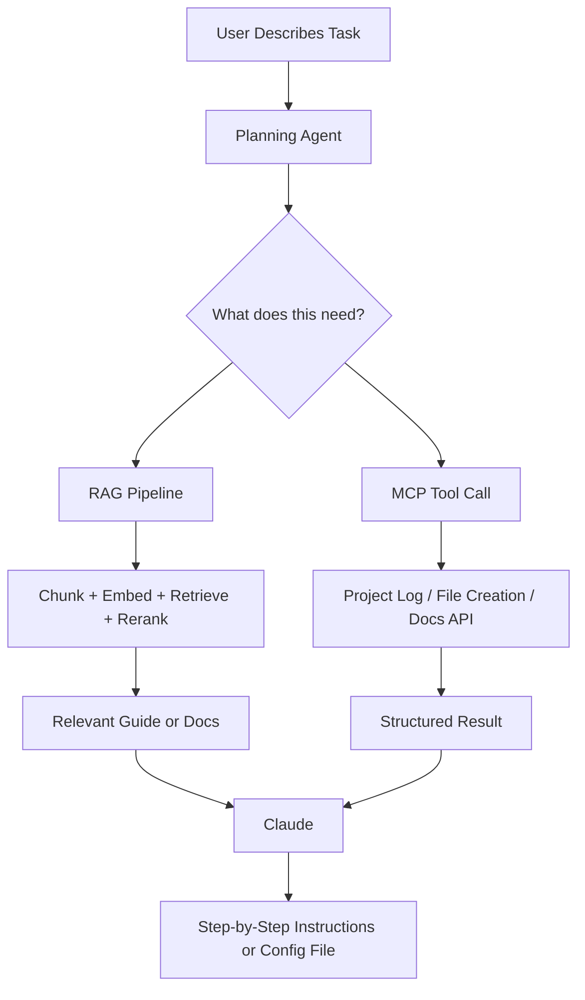

# Architecture Proposal: Beginner DevOps Learning Tracker

## Project Overview

A lightweight DevOps project tracker that helps beginners log what they are building, retrieve relevant guides and setup instructions, and get step-by-step help from an AI assistant. Users describe what they are working on, the system retrieves relevant documentation, and an agent breaks the task into actionable steps.

---

## Patterns Used

### Pattern 1: Retrieval-Augmented Generation (RAG)

**Why it fits:**
DevOps setup instructions are highly specific to tools, versions, and environments. Relying on model memory risks outdated or incorrect guidance. RAG grounds every response in curated, version-aware documentation pulled from a local knowledge base.

**What data it connects to:**
- A library of beginner DevOps guides (Docker, GitHub Actions, SSH, Nginx, AWS EC2) stored as chunked, embedded documents
- User-uploaded notes or config files indexed per session for context-aware help

**Risk / Limitation:**
Retrieval quality depends on chunking decisions made upfront. Documentation that mixes multiple tools in one page produces noisy chunks and degrades precision. Good chunk boundaries are essential before any retrieval runs.

---

### Pattern 2: MCP (Model Context Protocol)

**Why it fits:**
The assistant needs to interact with real capabilities: checking project status, writing config files, and calling external documentation APIs. Embedding this logic in prompts is fragile. MCP exposes each capability as a named, schema-validated tool so Claude selects and invokes them reliably.

**What services it connects to:**
- A project log resource exposing the user's current tasks and progress
- File creation tools for generating Dockerfiles, GitHub Actions workflows, and config templates
- External docs APIs for fetching up-to-date tool references

**Risk / Limitation:**
Every new tool integration requires a properly defined schema. Loose or missing schemas cause silent failures where Claude invokes a tool with bad inputs and receives unhelpful errors rather than useful output.

---

## System Diagram

---

## How the Patterns Work Together

The planning agent receives the user's task description and decides what is needed before anything executes. If documentation is required, it triggers the RAG pipeline. If an action is required such as generating a config file or checking project status, it invokes the appropriate MCP tool. Claude receives both retrieved context and tool results, reasons over them, and produces actionable output.

Each component stays modular and replaceable without touching Claude's reasoning layer.

---

## One Anticipated Risk Per Pattern

| Pattern | Risk |
|---|---|
| RAG | Mixed-tool documentation pages produce noisy chunks that degrade retrieval precision |
| MCP | Loosely defined schemas cause tool invocation failures that surface as unhelpful structured errors |
